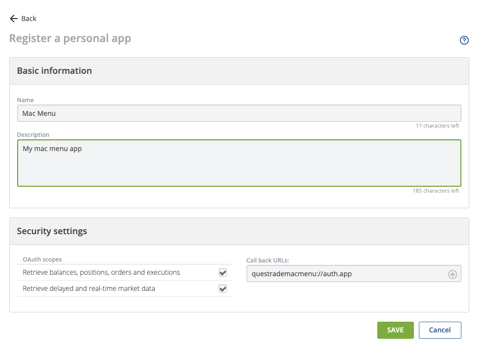
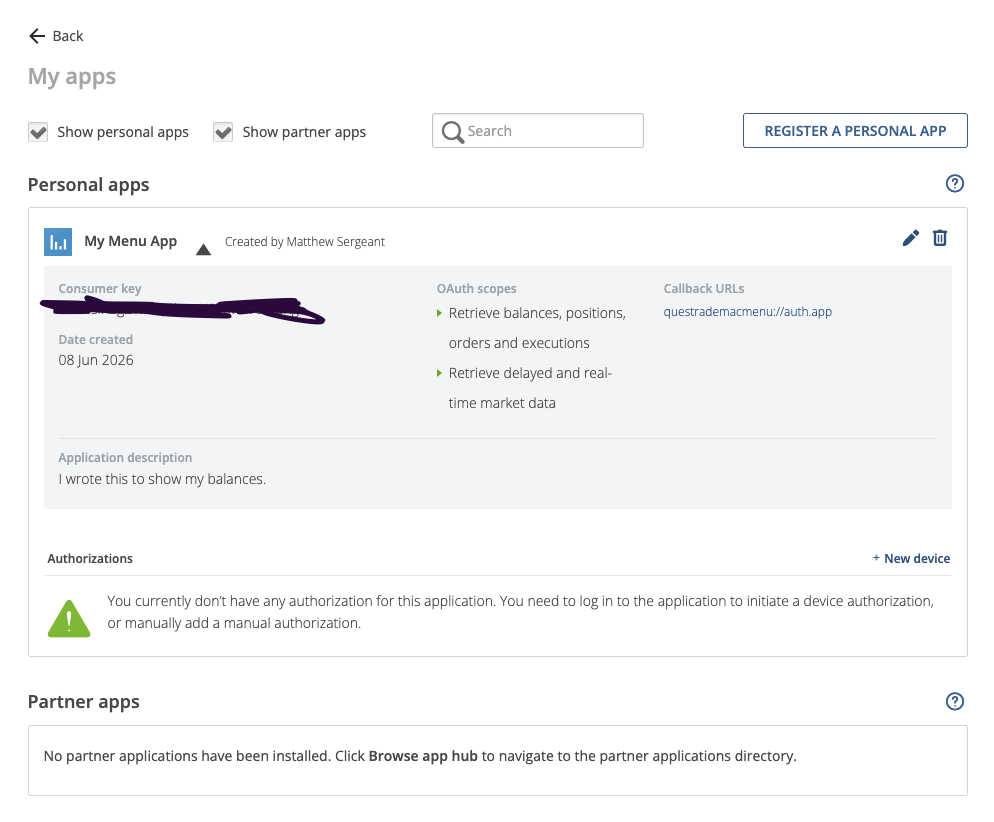

# Questrade Menu

A macOS menu bar app that shows your Questrade account value and today's P&L at a glance.

## Features

- Menu bar shows account value + today's P&L in green/red
- Dropdown shows total equity, cash, market value, open P&L, and today's P&L
- CAD / USD currency switcher
- Multiple accounts with left/right navigation
- Polls every 60 seconds; refreshes OAuth tokens automatically

## Getting started

### Step 1 — Register a personal app with Questrade

You need a **Consumer Key** from Questrade to authorise the app. This takes about two minutes.

1. Go to **[https://apphub.questrade.com/UI/ManageApp.aspx](https://apphub.questrade.com/UI/ManageApp.aspx)** and click **Register a Personal App**.

2. Fill in a name and description (anything you like), then set the fields exactly as follows:

   - **OAuth scopes** — check both:
     - ✅ Retrieve balances, positions, orders and executions
     - ✅ Retrieve delayed and real-time market data
   - **Callback URL** — must be **exactly**:
     ```
     questrademacmenu://auth.app
     ```
     The app will not be able to complete login if this is different.

   

3. Click **Save**.

### Step 2 — Find your Consumer Key

After saving, you'll be taken back to the **My Apps** list. Expand your app — the **Consumer Key** is the value shown under that heading (blacked out in the screenshot below). Copy it.



### Step 3 — Log in

1. Launch **Questrade Menu** — a **Q** icon appears in your menu bar.
2. Click it and paste your Consumer Key into the field.
3. Click **Login with Questrade** — a Questrade login page opens in your browser.
4. Sign in and approve access. The window closes automatically and your balances appear.

---

For build instructions, running from source, and CI configuration see [docs/DEVELOPER.md](docs/DEVELOPER.md).

